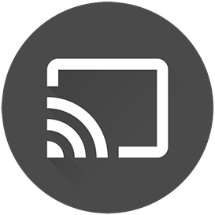

<h1 align="center">
  Continuously Casting Dashboards
</h1>


<p align="center">
  
</p>

<p align="center">
  <strong>Keep your Home Assistant dashboards always visible on Chromecast displays</strong>
</p>

<p align="center">
  <a href="#installation">Installation</a> •
  <a href="#quick-start">Quick Start</a> •
  <a href="#configuration">Configuration</a> •
  <a href="#-migrating-from-yaml-to-ui">Migration</a> •
  <a href="#troubleshooting">Troubleshooting</a>
</p>

---

A Home Assistant integration that automatically casts dashboards to your Chromecast devices and keeps them running. If a dashboard gets interrupted (someone asks Google a question, plays music, etc.), it automatically resumes once the device is idle.

<p align="center">
  
</p>

## ✨ Features

- **Auto-resume** - Dashboard automatically restarts if interrupted
- **Smart detection** - Won't interrupt Spotify, Netflix, YouTube, timers, or Google Assistant
- **Time windows** - Only cast during specified hours (e.g., 7am-11pm)
- **Multiple dashboards** - Different dashboards at different times on the same device
- **Entity control** - Start/stop casting based on any Home Assistant entity state
- **Speaker group aware** - Won't cast if device is part of an active speaker group
- **Per-device settings** - Volume, time windows, and dashboards configured per device

## 📋 Requirements

Before installing, ensure you have:

| Requirement | Description |
|-------------|-------------|
| **HTTPS Access** | Home Assistant must be accessible via HTTPS. Use [Nabu Casa](https://www.nabucasa.com/) or [set up SSL yourself](https://www.makeuseof.com/secure-home-assistant-installation-free-ssl-certificate/) |
| **Trusted Networks** | Chromecast devices must be able to access HA without login ([setup guide](#trusted-networks-setup)) |
| **ha-catt-fix** | Prevents display timeout after 10 minutes ([install via HACS](#install-ha-catt-fix)) |
| **Kiosk Mode** | *Optional* - Hides navigation bars for fullscreen display ([install via HACS](https://github.com/NemesisRE/kiosk-mode)) |

## 📦 Installation

### Via HACS (Recommended)

1. Open HACS in Home Assistant
2. Click the three dots (⋮) → **Custom repositories**
3. Add `b0mbays/continuously_casting_dashboards` as an **Integration**
4. Search for "Continuously Casting Dashboard" and click **Download**
5. Restart Home Assistant

### Manual Installation

1. Download the `continuously_casting_dashboards` folder from this repository
2. Copy it to `config/custom_components/`
3. Restart Home Assistant

## 🚀 Quick Start

### 1. Add the Integration

1. Go to **Settings** → **Devices & Services**
2. Click **Add Integration**
3. Search for "Continuously Casting Dashboards"
4. Follow the setup wizard

### 2. Configure Your First Device

The wizard will guide you through:

1. **Global settings** - Logging level, cast delay, default time window
2. **Add device** - Enter your Chromecast display name (from Google Home app), its IP address, or both. At least one is required. You can also set an optional alias as a display name.
3. **Dashboard URL** - The full URL to your dashboard (e.g., `http://192.168.1.100:8123/lovelace/dashboard?kiosk`)

> **Tip:** Use your Home Assistant's local IP address in the dashboard URL, not `homeassistant.local`

### 3. Done!

The integration will start casting your dashboard during the configured time window.

---

## ⚙️ Configuration

### UI Configuration (Recommended)

All settings can be managed through **Settings** → **Devices & Services** → **Continuously Casting Dashboards**.

**Managing device dashboards**
- Click **Configure** on a device to edit its dashboard settings in a single form.
- To add another dashboard, enable **“Add another dashboard after saving”**.
- If a device has multiple dashboards, use **“Edit a different dashboard”** to switch which one you’re editing.

### YAML Configuration (Legacy)

> **Note:** UI configuration is now the recommended method. YAML configuration is supported for backward compatibility but new features may only be available in the UI.

Add to your `configuration.yaml`:

```yaml
continuously_casting_dashboards:
  logging_level: warning    # debug, info, warning, error, critical
  cast_delay: 45            # Seconds between device checks (5-300)
  start_time: "07:00"       # Global start time (HH:MM)
  end_time: "01:00"         # Global end time (HH:MM)

  devices:
    "Living Room Display":  # Device name from Google Home app
      - dashboard_url: "http://192.168.1.100:8123/lovelace/home?kiosk"
        volume: 5           # Optional: 0-100
        start_time: "06:00" # Optional: Override global time
        end_time: "23:00"

    "Kitchen Hub":
      - dashboard_url: "http://192.168.1.100:8123/lovelace/kitchen?kiosk"
        volume: 7
```

### Configuration Options

| Option | Required | Default | Description |
|--------|----------|---------|-------------|
| `logging_level` | Yes | `warning` | Log verbosity: `debug`, `info`, `warning`, `error`, `critical` |
| `cast_delay` | Yes | `45` | Seconds between checking each device (5-300) |
| `start_time` | No | `07:00` | When to start casting (HH:MM format) |
| `end_time` | No | `01:00` | When to stop casting (HH:MM format) |
| `switch_entity_id` | No | - | Entity that controls casting on/off globally |
| `switch_entity_state` | No | `on` | State value that enables casting |
| `enable_notifications` | No | `true` | Show a HA notification when a device becomes unreachable |

### Per-Device Options

| Option | Required | Default | Description |
|--------|----------|---------|-------------|
| `dashboard_url` | Yes | - | Full URL to the dashboard |
| `volume` | No | - | Device volume (0-100) |
| `start_time` | No | Global | Override the global start time |
| `end_time` | No | Global | Override the global end time |
| `switch_entity_id` | No | - | Entity that controls this specific device |
| `switch_entity_state` | No | `on` | State value that enables casting for this device |
| `speaker_groups` | No | - | Speaker groups to check before casting |

---

## 🔧 Advanced Usage

### Multiple Dashboards Per Device

Cast different dashboards at different times:

```yaml
devices:
  "Office Display":
    - dashboard_url: "http://192.168.1.100:8123/lovelace/day?kiosk"
      start_time: "07:00"
      end_time: "18:00"
    - dashboard_url: "http://192.168.1.100:8123/lovelace/night?kiosk"
      start_time: "18:00"
      end_time: "23:59"
```

### Control Casting with Entity State

Control casting globally or per-device using any Home Assistant entity:

```yaml
# Create a toggle in configuration.yaml
input_boolean:
  enable_dashboard_casting:
    name: "Enable Dashboard Casting"
    initial: on

# Reference it in the integration config
continuously_casting_dashboards:
  switch_entity_id: "input_boolean.enable_dashboard_casting"
  # ... rest of config
```

**Default "on" states:** `on`, `true`, `home`, `open`

For custom states, use `switch_entity_state`:

```yaml
continuously_casting_dashboards:
  switch_entity_id: "sensor.house_mode"
  switch_entity_state: "occupied"
```

### Speaker Group Handling

Prevent casting when the device is playing in a speaker group:

```yaml
devices:
  "Kitchen Hub":
    - dashboard_url: "http://192.168.1.100:8123/lovelace/kitchen?kiosk"
      speaker_groups:
        - "Kitchen Speakers"
        - "Whole House Audio"
```

### Runtime Configuration via Services

Adjust settings without restarting using Home Assistant services:

```yaml
# Change cast delay
service: continuously_casting_dashboards.set_cast_delay
data:
  delay: 60

# Change time window
service: continuously_casting_dashboards.set_start_time
data:
  time: "08:00"

# Change logging level
service: continuously_casting_dashboards.set_logging_level
data:
  level: debug

# Stop a specific device (omit device_name to stop all)
service: continuously_casting_dashboards.stop_casting
data:
  device_name: "Living Room Display"

# Resume a specific device (omit device_name to check all)
service: continuously_casting_dashboards.resume_casting
data:
  device_name: "Living Room Display"
```

**Available services:**
- `set_cast_delay` - Cast interval (5-300 seconds)
- `set_logging_level` - debug, info, warning, error, critical
- `set_start_time` - Start time (HH:MM)
- `set_end_time` - End time (HH:MM)
- `stop_casting` - Stop casting on a device or all devices
- `resume_casting` - Resume casting on a device or trigger check on all devices

---

## 🔄 Migrating from YAML to UI

If you're currently using YAML configuration (`configuration.yaml`), follow these steps to migrate to the new UI-based configuration:

Migration guide: [Migrating from YAML to UI](#-migrating-from-yaml-to-ui)

### Automatic Migration

1. **Update the integration** via HACS
2. **Restart Home Assistant**
3. Your YAML config will be **automatically imported** into the UI
4. A notification will appear confirming the import
5. **Remove** the `continuously_casting_dashboards:` section from your `configuration.yaml`
6. Restart Home Assistant again

Your devices will continue working. You can now manage everything through the UI.

### After Migration

Once migrated, each device appears separately on the integration page:

```
Settings → Devices & Services → Continuously Casting Dashboards
├── ⚙️ Configure (Global Settings)
├── 📱 Living Room Display → Configure
├── 📱 Kitchen Hub → Configure
└── ➕ Add Device
```

Click **Configure** on any device to manage its dashboards individually.
Use **“Add another dashboard after saving”** to add more dashboards for a device, and **“Edit a different dashboard”** when multiple dashboards exist.

> **Important:** After migration, remove the YAML configuration to avoid conflicts. The integration will show a warning if YAML config is detected alongside UI config.

---

## 📖 Setup Guides

### Trusted Networks Setup

Chromecast devices need to access Home Assistant without logging in.

1. Find your Chromecast device IPs (Settings → Device Information → Technical Information on each device)

2. Add to your `configuration.yaml`:

```yaml
homeassistant:
  auth_providers:
    - type: trusted_networks
      trusted_networks:
        - 192.168.1.50/32   # Living Room Display
        - 192.168.1.51/32   # Kitchen Hub
      trusted_users:
        192.168.1.50: YOUR_USER_ID
        192.168.1.51: YOUR_USER_ID
      allow_bypass_login: true
    - type: homeassistant    # Keep normal login for other devices
```

> **Find your user ID:** Go to your profile in Home Assistant and look at the URL - the ID is the long string after `/profile/`

### Install ha-catt-fix

This prevents the dashboard from timing out after 10 minutes.

1. Open HACS → Click three dots (⋮) → **Custom repositories**
2. Add `swiergot/ha-catt-fix` as a **Dashboard** (previously called "Lovelace")
3. Go to **Frontend** tab → Search "ha-catt-fix" → **Download**
4. Restart Home Assistant
5. Verify installation: Open your dashboard → Edit → Manage resources → Confirm ha-catt-fix is listed

---

## ❓ Troubleshooting

### Dashboard stops after a few seconds

**Cause:** ha-catt-fix not installed correctly.

**Solution:**
1. Set `logging_level: debug` in your config
2. Check Home Assistant logs for status output
3. Look for `Title: Dummy` in the logs - if missing, reinstall ha-catt-fix

```
DEBUG Status output for Office display: Title: Dummy 22:27:13 GMT+0000
```

### Device not found

**Cause:** Device name doesn't match exactly.

**Solution:**
- Check the exact name in Google Home app or on the device itself
- In the device settings, add the IP address directly in the **IP Address** field — this bypasses name lookup entirely and is more reliable

### Dashboard won't cast

**Checklist:**
- [ ] HTTPS is configured for Home Assistant
- [ ] Device IP is in trusted networks
- [ ] Dashboard URL uses local IP (not `homeassistant.local`)
- [ ] Current time is within the configured time window
- [ ] No media is playing on the device

### Device shows as unreachable

If a device temporarily loses network connectivity (e.g. MDNS flakiness), the integration will mark it as unreachable and show a persistent notification in Home Assistant. The dashboard resumes automatically once the device comes back online and the notification is dismissed.

If you have a device with an unreliable network and find the notifications noisy, you can disable them in **Settings** → **Devices & Services** → **Continuously Casting Dashboards** → **Configure** → uncheck **Enable notifications**.

### Annoying phone notifications for "DashCast"

**Solution:** On your Android phone:
Settings → Google → Devices & sharing → Cast options → Turn off "Media controls for Cast devices"

---

## 💬 Support

- **Issues:** [GitHub Issues](https://github.com/b0mbays/continuously_casting_dashboards/issues)
- **Discussions:** [GitHub Discussions](https://github.com/b0mbays/continuously_casting_dashboards/discussions)

---

<p align="center">
  <sub>Tested with Lenovo Smart Display 8, Google Nest Hub (1st Gen)</sub>
</p>
