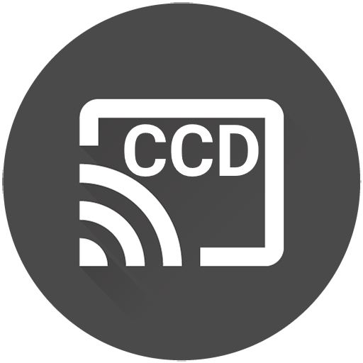

# <center>**HA - Continuously Casting Dashboards** </center>

<p align="center">
  
</p>


This custom integration for Home Assistant continuously casts dashboards to Chromecast devices during a specified time window. It ensures that the dashboard is always displayed during the active time window, even if the Chromecast device is accidentally interrupted or disconnected. It will ignore any devices that are currently playing Spotify, Netflix, Recipes etc. Timers will be overtaken by the dashboard but will continue to operate in the background.

I'm using this myself for 5 chromecast devices: Lenovo Smart Display 8 & four 1st Gen Google Nest Hubs.

<p align="center">
  
</p>
<br/><br/>

✨**Features:**
============

- Automatically casts specified Home Assistant dashboards to Chromecast devices.
- Monitors the casting state of each device and resumes casting if interrupted.
- Entity changed dashboard casting (cast specific dashboards when an entity state changes).
- Configurable global time window for active casting.
- Configurable casting interval.
- Configurable volume per device.
- Configurable start and end times per device.
- Debug logging support.

<br/><br/>

✅ **Requirements:**
============

1. **Home Assistant** (with https [external access setup](https://www.makeuseof.com/secure-home-assistant-installation-free-ssl-certificate/?newsletter_popup=1) required for casting) and the HACS Addon installed.

2. **Trusted network setup** for each Chromecast device to avoid logging in. See guide [here](https://blog.fuzzymistborn.com/homeassistant-and-catt-cast-all-the-things/) and follow the 'Trusted Networks' section half way down. You can either do your entire home network, or individual devices. You can find the IP address for each device by going to Settings -> Device Information -> Technical Information on the device.

3. **[ha-catt-fix](https://github.com/swiergot/ha-catt-fix)** setup for your dashboard to keep the display 'awake' and not time out after 10 minutes. Install steps:

    - Go to the HACS panel in Home Assistant
    - Click on the three dots in the top right corner and choose "Custom repositories"
    - Enter `swiergot/ha-catt-fix` in the "Add custom repository" field, select "Lovelace" from the "Category" dropdown, and click on the "Add" button.
    - Go to the "Frontend" tab within HACS, and click on 'Explore and download repositories" and search for 'ha-catt-fix'.
    - Click "Download"
    - Restart Home Assistant
    - Ensure that 'ha-catt-fix' is listed inside your dashboards resources. (_Your dashboard_ -> Three dots -> Edit -> Three dots -> Manage resources)

4. **[Kiosk Mode](https://github.com/NemesisRE/kiosk-mode)** for hiding the navigations bars for fullscreen dashboards on your displays.

<br/><br/>

🚀**Installation**
============

### **HACS**

1. Go to the HACS panel in Home Assistant.
2. Click on the three dots in the top right corner and choose "Custom repositories".
3. Enter `b0mbays/continuously_casting_dashboards` in the "Add custom repository" field, select "Integration" from the "Category" dropdown, and click on the "Add" button.
4. Once the custom repository is added, you can install the integration through HACS. You should see "Continuously Cast Dashboards" in the "Integrations" tab. Click on "Download" to add it to your Home Assistant instance.
5. Restart Home Assistant to load the custom integration.
6. Setup your devices inside the configuration.yaml file, follow the steps from the configuration section below.
4. Restart again to start the integration.

<br/><br/>

⚡️**How does it work?**
============

This integration runs in the background on your HA instance, so no external device is required. If you'd prefer to run it on a Raspberry Pi or similiar linux box then you can try out [HA-Pi-Continuously-Cast](https://github.com/b0mbays/ha-pi-continuously-cast). However, I have had no issues running this on my Home Assistant instance.

The integration uses [CATT's](https://github.com/skorokithakis/catt) functionality to 'call' each of your Google Chromecast devices checking the status every 45 seconds (you can change this in the config) for any 'state' changes. If there is no media playing on the device, then the dashboard will be cast. If the device already has the dashboard casting then it will be ignored. And if there is youtube/recipes/spotify playing on the device then it will also be ignored.

The casting functionality within Home Assistant requires your instance to be accesible via HTTPS with either paying for a Nabu Casu subscription or setting this up yourself. Home Assistant does offer an in-built casting option but I found this to be unreliable for me and I couldn't get it working properly without paying for a Nabu Casu subscription... Instead, I wanted to host HA externally myself for free. (well, $1 p/year). The guide I used is [here](https://www.makeuseof.com/secure-home-assistant-installation-free-ssl-certificate/?newsletter_popup=1) and I bought a domain for $1 from [here](https://gen.xyz/).


<br/><br/>

⚙️**Configuration**
============

To configure the integration, add the following to your `configuration.yaml` file:

```yaml
continuously_casting_dashboards:
  logging_level: warning #Required: Set the logging level - debug/info/warning (default is 'warning' - try 'debug' for debugging)
  cast_delay: 45 #Required: Time (in seconds) for casting checks between each device.
  start_time: "07:00" #Optional: Global start time of the casting window (format: "HH:MM") - Default is set to "07:00" and can be individually overwritten per device below.
  end_time: "01:00" #Optional: Global end time of the casting window (format: "HH:MM") and must be after "00:00". Default is set to "01:00" and can be individually overwritten per device below.
  devices:
    "<Display_Name": #Required: Display name of your device. Find this on the actual device's settings or inside the Google Home app.
        dashboard_url: "<Dashboard_URL>" #Required: Dashboard URL to be casted (This must be the local IP address of your HA instance, not homeassistant.local)
        volume: <Volume> #Optional: Volume to set the display. (If you remove this, the device will remain the same volume)
        start_time: "<Start_Time>" #Optional: Set the start time for this device
        end_time: "<End_Time>" #Optional: Set the end time for this device
    "<Display_Name": 
        dashboard_url: "<Dashboard_URL>" 
        volume: <Volume>
        start_time: "<Start_Time>" 
        end_time: "<End_Time>"

    #You can then add more devices repeating the above format:

    # Examples:
    # "Office display":
    #   dashboard_url: "http://192.168.12.104:8123/nest-dashboard/default_view?kiosk"
    #   volume: 7
    #   start_time: "06:00" 
    #   end_time: "18:00"
    # "Kitchen display":
    #   dashboard_url: "http://192.168.12.104:8123/kitchen-dashboard/default_view?kiosk"
    #   volume: 9
    #   start_time: "06:00" 
    #   end_time: "22:00"
    # "Basement display":
    #   dashboard_url: "http://192.168.12.104:8123/nest-dashboard/default_view?kiosk"
    #   volume: 4
    #   start_time: "18:00" 
    #   end_time: "03:00"
```


<br/><br/>
**🔄 Entity changed dashboard casting**
============


With this feature, you can configure specific dashboards to be cast when the state of a specified entity changes. To enable this feature, add a new section to your configuration.yaml file:

```yaml
continuously_casting_dashboards:
  # ...
  state_triggers:
    "<Display_Name>":
        - entity_id: "<Entity_ID>"
          to_state: "<To_State>"
          dashboard_url: "<Dashboard_URL>"
          time_out: <Timeout_time> #Optional!
          force_cast: <true or false> #Optional!
```

Replace **<Display_Name>** with the Chromecast device, **<Entity_ID>** with the desired entity ID, **<To_State>** with the state that triggers the casting and **<Dashboard_URL>** with the URL of the dashboard you want to cast.

**<time_out>** is an optional field to "time out" a specific dashboard after a certain amount of time(in seconds). There is an example use case below.

**<force_cast>** is another optional field to indicate if the dashboard should be casted even if media is playing on the device. This is set to 'false' by default.

You can add multiple entity-triggered casting configurations by adding more sections following the same format.

Example:

```yaml
continuously_casting_dashboards:
  # ...
  state_triggers:
    "Living room display":
        - entity_id: "sensor.samsung_tv"
          to_state: "On"
          dashboard_url: "http://192.168.12.104:8123/tv_remote_dashboard/default_view?kiosk"
        - entity_id: "sensor.samsung_tv"
          to_state: "Off"
          dashboard_url: "http://192.168.12.104:8123/living_room_dashboard/default_view?kiosk"
```
The first example for the "Living room display" will cast my custom "tv_remote_dashboard" which has my TV remote controls to my Nest Hub when my TV entity reports the status of "On". When the TV turns off and now reports a status of "Off" then my normal "living_room_dashboard" will be casted.

```yaml
continuously_casting_dashboards:
  # ...
  state_triggers:
    "Office display":
        - entity_id: "binary_sensor.front_door_ring"
          to_state: "Detected"
          dashboard_url: "http://192.168.12.104:8123/cctv_dashboard/default_view?kiosk"
          time_out: 60
          force_cast: true
```


The second example will cast my custom "cctv_dashboard" which has cameras of the front door when my Ring doorbell is "Detected". I am using the optional "time_out" feature which will stop casting the CCTV display after 60 seconds. Once the dashboard has then stopped casting, the default dashboard will start casting to this display. I also have the 'force_cast' set to 'true' to ensure that even if media is playing on this device, then the CCTV dashboard will be casted.

<br/><br/>

⚠️**Troubleshooting**
============

- The dashboard starts on my device and then stops within a few seconds.

    If this is happening, you may not have installed the ha-catt-fix correctly and your device will be using a different state name for when a dashboard is "active". The device should be reporting "Dummy". You can find out what your device is reporting by changing the "logging_level" to "debug"; then going to the Home Assistant logs and you will see logs for this integration. In the logs you should find a log checking the status output for a working dashboard state. For example, mine looks like this:


    ```
    DEBUG (MainThread) [custom_components.continuously_casting_dashboards.dashboard_caster] Status output for Office display when checking for dashboard state 'Dummy': Title: Dummy 22:27:13 GMT+0000 (Greenwich Mean Time)
    Volume: 50
    ```

    If "Dummy" is missing here, please ensure you have installed the ha-catt-fix correctly from following the instructions from the [requirements](#requirements) section.
